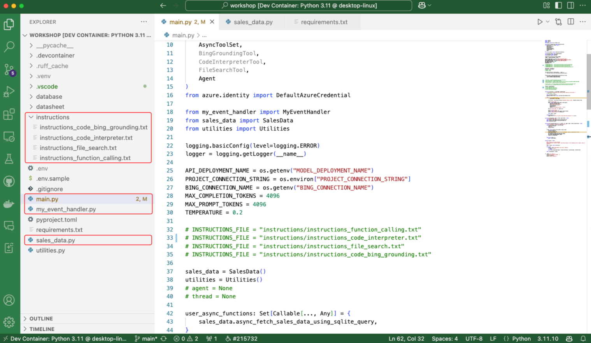

# Getting Started with the Workshop

This workshop is designed to help you get started with the Azure AI Agents Service and the Python SDK. It is divided into multiple labs, each focusing on a specific feature of the Azure AI Agents Service. The labs are intended to be completed in sequence, with each lab building on the previous one.

## Lab Structure

Each lab in this workshop includes:

- An **Introduction**: Explains the relevant concepts.
- An **Exercise**: Guides you through the process of implementing the feature.

## Understanding the Project Structure

When you open the workshop in Visual Studio Code, you will see the following folder structure. Take note of the key folders and files you will be working with during the workshop:

1. The **instructions**: folder contains the instructions passed to the LLM.
2. The **main.py**: The entry point for the application, containing its main logic.
3. The **sales_data.py**: Contains the function logic to execute dynamic SQL queries against the SQLite database.
4. The **stream_event_handler.py**: Contains the event handler logic for token streaming.



## AI Tour Workshop

If you’re participating in this workshop as part of the AI Tour, the environment has already been fully set up for you. Follow these steps to open the workshop in Visual Studio Code:

1. Open a terminal window.
2. From the terminal window, clone the workshop repo by running the following command:

    ```shell
    git clone https://github.com/gloveboxes/contoso-sales-ai-agent-service-workshop.git
    ```

3. Navigate to the workshop `src/workshop` folder for the repository you cloned in the previous step.

    ```shell
    cd contoso-sales-ai-agent-service-workshop/src/workshop
    ```

4. Create a virtual environment by running the following command:

    ```shell
    python -m venv .venv
    ```

5. Activate the virtual environment by running the following command:

    ```shell
    source .venv/bin/activate
    ```

6. Install the required packages by running the following command:

    ```shell
    pip install -r requirements.txt
    ```

7. Open in VS Code. From the terminal window, run the following command:

    ```shell
    code .
    ```

## Configure the Environment

1. In VS Code, **create** a .env file in the **root** of the workshop folder.
1. Copy the Configuration
    - Open the .env file on the **desktop** and **copy** its contents into the .env file in the root of the **workshop** folder you just created.
1. Save Changes
    - **Save** the changes to the .env file.
